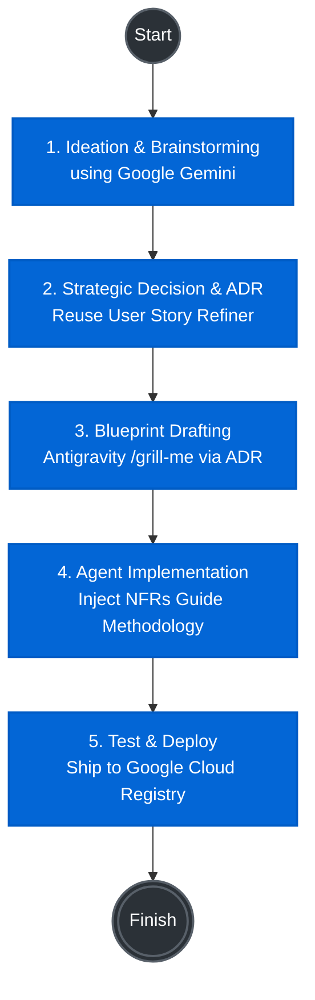

Software rarely fails because it lacks a feature; it fails because it cannot scale, cannot recover, or cannot be securely maintained. Yet, Non-Functional Requirements (NFRs) are routinely treated as an afterthought, reduced to vague, untestable wishes like "the system must be reliable." This upfront ambiguity is the leading cause of crippling technical debt, endless refactoring, and late-stage architectural collapse.

Enter the **NFR Refiner**: an intelligent assistant that transforms static engineering methodologies into a live, interactive experience. The NFR Refiner agent doesn't just passively record requirements. It actively interviews stakeholders, enforces strict quality standards, fetch real-world industry benchmarks, and translates fuzzy human intent into strictly verifiable Planguage based specifications.

# 💡 Project Vision & Innovation

## The Central Idea

Non-Functional Requirements (NFRs)—such as performance, security, and maintainability—are the invisible scaffolding of robust software. Yet, they are notoriously difficult to elicit, often resulting in vague statements like *"the system must be fast."* The **NFR Refiner** is an intelligent, agent system designed to solve this problem. It acts as an interactive architectural assistant that interviews stakeholders, identifies missing constraints, and translates ambiguous desires into strictly verifiable, industry-standard **Planguage** specifications. By marrying structural strictness with conversational AI, the Refiner ensures that critical system constraints are captured accurately before a single line of code is written.

## The Agentic Core

Agents are not just a feature of this project; they are its central operational engine. Standard procedural code cannot dynamically navigate the ambiguity of human requirements. We rely on the reasoning engine to handle the difficulty of requirements gathering and use web search for looking up associated industry-standard baselines and best practices.

## Key Highlights & Value Proposition

* 🌱 **Ecosystem Expansion via Google's Agent Garden**
This project illustrates the power of effective reuse within the intelligent multi-agent ecosystem. Rather than reinventing the wheel, the NFR Refiner strategically leverages **Google's Agent Garden** to expand the existing agentic workforce. The starting point was the [User Story Refiner](https://github.com/google/adk-samples/tree/main/python/agents/sdlc-user-story-refiner) agent that covers the functional aspects of a system. By composing our solution with pre-built, high-quality agentic assets and grounding tools, we demonstrate how developers can rapidly assemble complex, specialized workflows that contribute back to the broader ecosystem.
* 📖 **Breathing Life into Static Methodologies**
Historically, scaling software engineering practices relies on static wikis, PDFs, or guides that are easily ignored or misunderstood by development teams. This project transforms the static [NFRs Guide](https://github.com/evarga/nfrs-guide) into a **live, interactive entity**. The agent embodies the methodology, actively coaching the user and enforcing quality standards (Correctness, Completeness, Verifiability) in real-time, effectively scaling software engineering practices across the organization.
* 🏗️ **Championing Upfront Design and ADRs**
The NFR Refiner highlights the critical importance of defining system boundaries early and documenting pertinent design decisions in form of **Architecture Decision Records (ADRs)**. Beyond just historical documentation, these ADRs actively drive the search for reusable architectural artifacts. Furthermore, they serve as a foundational input for Antigravity to craft precise blueprints for future systems, directly contributing to the realization of a scalable, factory-model approach to SDLC.

# Usage and Internal Details

## Project Structure

The structure below reflects the final state, after following the steps in the [Quick Start](#quick-start) section.

```
<root>/
├── deployment/                # Deployment scripts (auto-generated)
├── docs/decisions/            # ADRs
├── nfr_refiner/               # Core agent code
│   ├── agent.py               # Main agent logic
│   ├── prompty.py             # System instructons for the agent.
│   ├── config.py              # Configuration options for the agent.
│   ├── fast_api_app.py        # FastAPI Backend server (auto-generated)
│   ├── app_utils/             # App utilities and helpers (auto-generated)
│   └── tools/                 # Custom tools used by the agent.
├── tests/                     # Unit, integration, and load tests (auto-generated)
├── GEMINI.md                  # AI-assisted development guide (auto-generated)
└── pyproject.toml             # Project dependencies
```

> 💡 **Tip:** Use [Antigravity CLI](https://antigravity.google/) for AI-assisted development - project context is pre-configured in `GEMINI.md`.

## Requirements

Before you begin, ensure you have:
- **uv**: Python package manager (used for all dependency management in this project) - [Install](https://docs.astral.sh/uv/getting-started/installation/) ([add packages](https://docs.astral.sh/uv/concepts/dependencies/) with `uv add <package>`)
- **agents-cli**: Agents CLI - Install with `uv tool install google-agents-cli`
- **Google Cloud SDK**: For GCP services - [Install](https://cloud.google.com/sdk/docs/install)


## Quick Start

Install `agents-cli` and its skills if not already installed:

```bash
uvx google-agents-cli setup
```

Create the local environment file `.env` (inside the project's root folder) based on the `.env.example` file.

Auto-generate boilerplate code and prepare for deployment:

```bash
agents-cli scaffold enhance --deployment-target agent_runtime --yes
```

Install required packages:

```bash
agents-cli install
```

Test the agent with a local web server:

```bash
agents-cli playground
```

You can also use features from the [ADK](https://adk.dev/) CLI with `uv run adk`.

## Development

Edit your agent logic in `nfr_refiner/prompt.py` and test with `agents-cli playground` - it auto-reloads on save.

## Deployment

```bash
gcloud config set project <your-project-id> \
agents-cli deploy --no-confirm-project
```

To add CI/CD and Terraform, run `agents-cli scaffold enhance`.
To set up your production infrastructure, run `agents-cli infra cicd`.

## Observability

Built-in telemetry exports to Cloud Trace, BigQuery, and Cloud Logging.

## A2A Inspector

This agent supports the [A2A Protocol](https://a2a-protocol.org/). Use the [A2A Inspector](https://github.com/a2aproject/a2a-inspector) to test interoperability.
See the [A2A Inspector docs](https://github.com/a2aproject/a2a-inspector) for details.

# 🏗️ How It Was Built: The Journey

The NFR Refiner was constructed using a modern, AI-accelerated workflow, taking the project from raw ideation to a fully deployed cloud asset in record time. Here is the high-level activity flow of our development process:



## Step-by-Step Breakdown

* **1. Ideation & Brainstorming**
The project kicked off with an intensive brainstorming session using Google Gemini to identify high-impact hackathon candidates. We focused on finding a problem space where intelligent agents could provide immediate, scalable value.
* **2. Strategic Reuse & ADR Crafting**
Instead of starting from scratch, we made the architectural decision to reuse and adapt an existing solution (the User Story Refiner). This allowed us to contribute directly back to a broader Software Development Life Cycle (SDLC) ecosystem. This pivotal design decision was immediately documented in an [Architecture Decision Record (ADR)](docs/decisions/0001-reuse-vs-build.md).
* **3. Blueprinting with Antigravity**
We leveraged the newly minted ADR as a direct input for **Antigravity**. Using a rigorous `/grill-me` [meta-prompt](docs/init-meta-prompt.md), Antigravity ingested the architectural constraints and drafted the candidate blueprint for the agentic system.
* **4. Implementing the Methodology**
With the blueprint in place, we customized the core agent logic. We translated the static rules of the standard *NFRs Guide* into dynamic, executable instructions, effectively turning the agent into a live enforcer of crucial methodologies.
* **5. Testing & Cloud Deployment**
Finally, the agent was tested locally using the Google Agents CLI and deployed directly into Google Cloud's Vertex AI Agent Runtime. This secured the agent within an enterprise-grade environment, complete with session management and discoverability via the Agent Registry.
